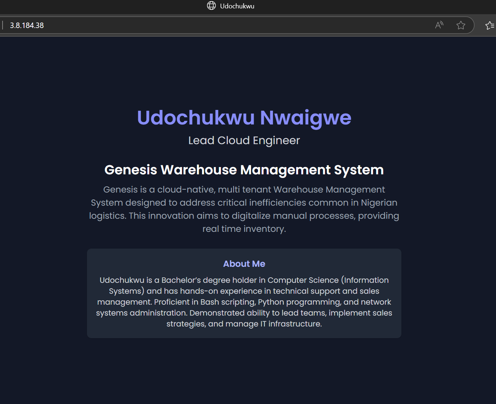

# Detailed Guide to How I Provisioned a Server
### Step 1: Launch an Ubuntu EC2 Instance on AWS
1. I logged into my AWS Console, to EC2 and launched a new instance.
2. The instance details are as follows;     
 + Name: altschool-exam
 + AMI: Ubuntu Server 22.04 LTS.
 + Instance type: t2.micro (free-tier eligible).
 + I created a new key pair (ED25519).
 + I created a new Security Group. I allowed SSH (port 22), HTTP (port 80), HTTPS (port 443).

## Step 2: SSH into the Instance using Termius
1. I created a new host, inserting it's name, public ip address.     
3. I created a new keychain, inputted the private key and exported it to the newly created host.

## Step 3: Web Server Setup
1. I decided to use nginx (for the first time).
2. I installed nginx. I also checked the status. I used the following commands;      
`sudo apt update`   
`sudo apt install nginx -y`     
`sudo systemctl status nginx`
3. Setup a Node.js App (reverse proxy)
+ I installed node.js using the following commands;                
`curl -fsSL https://deb.nodesource.com/setup_18.x | sudo -E bash`       
`sudo apt install -y nodejs`
4. I created node.js app in a new directory.      
5. I ran this command to run the node.js app;       
`node server.js`      
6. I configured nginx config file to setup nginx as a reverse proxy.      
7. I restarted nginx using this command;       
  `sudo systemctl restart nginx`

## Step 4: Dynamic Landing Page
1. I created a basic HTML & Tailwind CSS Page.      
2. I created a root directory for this HTML index file.
3. I pointed nginx to serve this HTML page.
4. I then reloaded nginx using;          
  `sudo systemctl reload nginx`
5. The page did not load in the browser. After much changes to config files, I decided to disable & stop nginx and install apache2, enable & start it. It worked.
6. The ip address where the page is hosted is http://3.8.184.38/

I tried inserting an image screenshot of my html page but for some reason, Github didn't render/display the image.

A new line of code.
